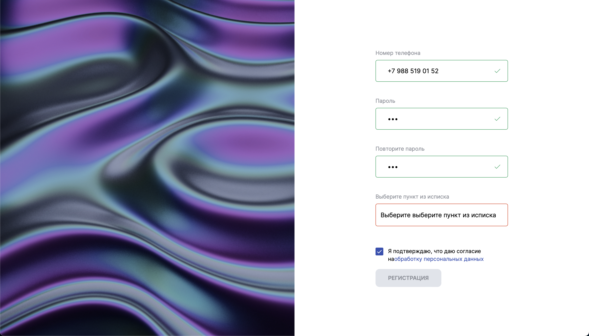

# Тествое задание для PARAWEB

## Описание задачи:
- Срок выполнения ТЗ: 10-12 часов;
## Функционал:
- Получение данных с мок-сервера;
- Отрисовка полученной формы;
- Адаптивный интерфейс.

## Стек технологий:
- HTML5;
- CSS3:
    - Flexbox;
    - Positioning;
    - Adaptive UI;
- CSS Module
- TypeScript
- Вёрстка по макету в Figma.

## Скриншот:

